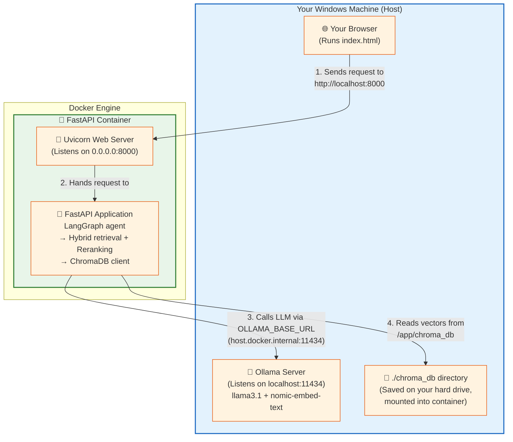

# Travel Copilot

A Retrieval-Augmented Generation (RAG) system that answers travel questions grounded in real travel-guide content, with citations. Built over the [Wikivoyage](https://en.wikivoyage.org) corpus, it combines hybrid retrieval, cross-encoder re-ranking, and tool-using generation, with a clean, provider-agnostic architecture.

> **Status:** The RAG core is complete. A FastAPI backend now exposes it as a REST API. The project is being extended into a fully deployed, full-stack GenAI web application (Next.js front-end + Azure) — see [Roadmap](#roadmap).

---

## What it does

Ask a natural-language travel question — *"where can I walk around a historic medieval city centre?"* — and the system retrieves the most relevant passages from the travel-guide corpus, then generates a grounded answer that cites its sources. It can also perform reliable budget/cost calculations via a sandboxed computation tool rather than trusting the language model's arithmetic.

## Architecture

The system separates two flows:

**Ingestion (offline):** `Wikivoyage XML dump → parse & clean → chunk → embed → store in vector DB`

**Query (runtime):** `question → hybrid retrieval → re-ranking → grounded, cited answer`

### Deployment architecture (Phase 3 — Docker)



**Key routing rules:**
- Browser → container: Docker intercepts `localhost:8000` on the host and forwards it to Uvicorn inside the container
- Container → Ollama: `host.docker.internal` is a Docker-provided hostname that resolves to the host machine; set via `OLLAMA_BASE_URL` env var
- ChromaDB: runs as an embedded library inside the container; the `chroma_db` directory is mounted as a volume so data persists across container restarts

### Key design decisions

- **Provider-agnostic LLM access.** All model calls (chat + embeddings) go through a single module with a `PROVIDER` switch, so swapping from local Ollama to Azure OpenAI is a one-line change. Implementation details never leak past this boundary.
- **Config as data, behavior in modules.** Configuration holds only settings; logic lives in the modules that act on them. Invalid configuration fails fast with a clear error.
- **Section-aware chunking.** Chunking respects the source documents' own structure (Wikivoyage sections), with a recursive character-splitting fallback for unstructured articles. Each chunk carries metadata (title, section) for citations.
- **Two-stage retrieval.** Hybrid search (dense vector + sparse BM25, fused with Reciprocal Rank Fusion) maximizes recall; a cross-encoder re-ranker (FlashRank) then maximizes precision over the shortlist.
- **Tool-using generation with a sandboxed calculator.** Arithmetic is delegated to a safe expression evaluator (no arbitrary code execution) so numeric answers are correct, not hallucinated.

## Retrieval pipeline — measured improvement

The retrieval stack was built and evaluated in stages, with documented before/after results (see [`results/`](results/)):

| Stage | Method | Fixes |
|-------|--------|-------|
| 1 | Vector search only | Baseline — strong on concepts, weak on proper nouns |
| 2a | Hybrid (BM25 + vector + RRF) | **Recall** — proper-noun queries now retrieve the right content |
| 2b | + Cross-encoder re-ranking | **Precision** — the most relevant chunk is ranked first |

Each stage addresses the previous stage's weakness — a clear recall-then-precision progression.

## Tech stack

- **Language:** Python 3.11 (Poetry for dependency management)
- **API:** FastAPI + Uvicorn — REST API with Pydantic validation and auto-generated OpenAPI docs
- **LLM / embeddings:** Ollama (local) — `llama3.1`, `nomic-embed-text`; architecture supports Azure OpenAI
- **Vector store:** ChromaDB (cosine similarity, HNSW index)
- **Retrieval:** BM25 (`rank-bm25`) + dense vectors, fused with RRF; FlashRank cross-encoder re-ranking
- **Orchestration:** LangChain components, LangGraph
- **Parsing/chunking:** `mwparserfromhell`, `langchain-text-splitters`

## Project structure

```
src/travel_copilot/
├── config.py              # settings + provider switch (data only)
├── llm.py                 # single boundary for all LLM/embedding calls
├── api/
│   └── main.py            # FastAPI app: GET /health, POST /ask
├── ingestion/
│   ├── parse.py           # streaming XML parse + markup cleaning
│   ├── chunk.py           # section-aware chunking
│   └── index.py           # embed + store in ChromaDB
├── retrieval/
│   ├── hybrid.py          # BM25 + vector search, RRF fusion
│   └── rerank.py          # FlashRank cross-encoder re-ranking
└── tools.py               # retrieval tool + sandboxed calculator
scripts/
├── ask.py                 # full RAG loop: question → grounded, cited answer
└── peek.py                # inspect the vector store
results/                   # staged retrieval evaluation (before/after)
index.html                 # minimal browser UI for local testing (no framework)
```

## Running it

### Prerequisites
- [Ollama](https://ollama.com) installed and running with the required models:
```bash
ollama pull llama3.1
ollama pull nomic-embed-text
```

### Option 1 — Docker (recommended)
Requires [Docker Desktop](https://www.docker.com/products/docker-desktop).

```bash
# Build and start the API container
docker compose up

# API available at http://localhost:8000
# Interactive docs at http://localhost:8000/docs
```

> On Windows/Mac, Docker routes Ollama calls via `host.docker.internal` automatically (configured in `docker-compose.yml`). No extra setup needed.

### Option 2 — Local (development)

```bash
# Install dependencies
poetry install

# Build the index from a Wikivoyage dump placed in data/
poetry run python -m src.travel_copilot.ingestion.index

# Ask a question via CLI
poetry run python -m scripts.ask "where can I walk around a historic medieval city centre?"

# Start the API server with live reload
poetry run uvicorn src.travel_copilot.api.main:app --reload
# API available at http://localhost:8000
# Interactive docs at http://localhost:8000/docs
```

## Roadmap

The RAG core is complete. The project is being extended into a full-stack, deployable GenAI web application:

- [x] **FastAPI** backend exposing the copilot as a REST API (`GET /health`, `POST /ask`)
- [ ] **Next.js + TypeScript** front-end (chat UI)
- [x] **Docker** containerization (`Dockerfile`, `docker-compose.yml`, CORS, configurable Ollama URL)
- [ ] **PostgreSQL + pgvector** for relational data and vector storage
- [ ] CI/CD pipeline (GitHub Actions)
- [ ] Evaluation harness (RAGAS) and observability

---

*Built as a hands-on exploration of production RAG architecture and end-to-end GenAI application engineering.*
